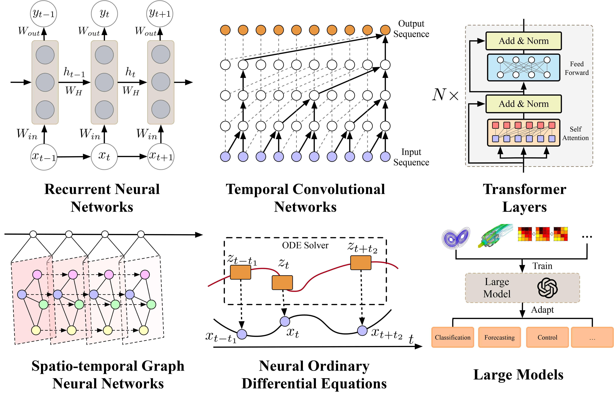
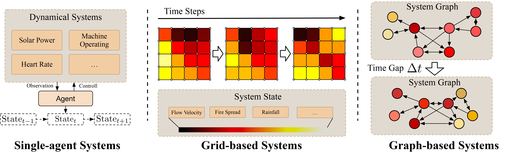

# Awesome-Dynamical-System-Modeling

# Awesome-AI4CFD

This review explores the recent advancements in dynamical system modeling.

<b> Awesome-AI4CFD </b> 

- [Awesome-Dynamical-System-Modeling](#awesome-ai4cfd)
  - [Datasets](#datasets)
  - [Network Architectures](#network-architectures)
  - [Applications](#applications)
  - [Contributing](#contributing)

---

## Datasets

| Dataset                 | Data Type    | Source   | Domains           |
|-------------------------|--------------|--------------------|-------------------|
| Solar Power Production   | Single-agent | [Modeling Long- and Short-Term Temporal Patterns with Deep Neural Networks](https://arxiv.org/abs/1703.07015)                  | Power Grid        |
| SMD                     | Single-agent | [Robust Anomaly Detection for Multivariate Time Series through Stochastic Recurrent Neural Network](https://dl.acm.org/doi/10.1145/3292500.3330672)                  | Anomaly Detection |
| Gesture                 | Single-agent | [uWave: Accelerometer-based personalized gesture recognition and its applications](https://www.sciencedirect.com/science/article/pii/S1574119209000674)                  | Human Motion      |
| Sleep-EEG               | Single-agent | [Analysis of a sleep-dependent neuronal feedback loop: the slow-wave microcontinuity of the EEG](https://ieeexplore.ieee.org/document/867928)                  | Healthcare        |
| Speech Commands          | Single-agent | [EXIT: Extrapolation and Interpolation-based Neural Controlled Differential Equations for Time-series Classification and Forecasting](https://dl.acm.org/doi/pdf/10.1145/3485447.3512030) | Speech            |
| IEEE SPC                | Single-agent | [Smart Devices are Different: Assessing and MitigatingMobile Sensing Heterogeneities for Activity Recognition](https://dl.acm.org/doi/abs/10.1145/2809695.2809718)                  | Healthcare        |
| Cardiovascular Disease   | Single-agent | [An Open Access Database for Evaluating the Algorithms of Electrocardiogram Rhythm and Morphology Abnormality Detection](https://www.ingentaconnect.com/contentone/asp/jmihi/2018/00000008/00000007/art00007)                  | Healthcare        |
| Spatial PDEs            | Grid         | [Learned Simulators for Turbulence](https://openreview.net/forum?id=msRBojTz-Nh)           | Physics           |
| MRMS                    | Grid         | [MetNet: A Neural Weather Model for Precipitation Forecasting](https://arxiv.org/abs/2003.12140)          | Climate           |
| FourCastNet             | Grid         | [FourCastNet: A Global Data-driven High-resolution Weather Model using Adaptive Fourier Neural Operators](https://arxiv.org/abs/2202.11214)          | Climate           |
| UCFCrime                | Grid         | [Real-world Anomaly Detection in Surveillance Videos](https://arxiv.org/abs/1801.04264)            | Anomaly Detection |
| FineGym                 | Grid         | [Frame-wise Action Representations for Long Videos via Sequence Contrastive Learning](https://arxiv.org/abs/2203.14957)            | Human Motion      |
| PennAction              | Grid         | [Frame-wise Action Representations for Long Videos via Sequence Contrastive Learning](https://arxiv.org/abs/2203.14957)             | Human Motion      |
| AirFoil                 | Graph        | [Learning Mesh-Based Simulation with Graph Networks](https://arxiv.org/abs/2010.03409)              | Physics           |
| CylinderFlow            | Graph        | [Learning Mesh-Based Simulation with Graph Networks](https://arxiv.org/abs/2010.03409)    | Physics           |
| InflatingFont           | Graph        | [Guaranteed Globally Injective 3D Deformation Processing](https://par.nsf.gov/servlets/purl/10290706)             | Physics           |
| Physion                 | Graph        | [Physion: Evaluating Physical Prediction from Vision in Humans and Machines](https://arxiv.org/abs/2106.08261)          | Physics           |
| PEMS-BAY                | Graph        | [Diffusion Convolutional Recurrent Neural Network: Data-Driven Traffic Forecasting](https://arxiv.org/abs/1707.01926)                | Transport         |
| Spring                  | Graph        | [Learning Continuous System Dynamics from Irregularly-Sampled Partial Observations](https://www.arxiv.org/abs/2011.03880)                 | Physics           |
| Social Network          | Graph        | [The Co-Evolution Model for Social Network Evolving and Opinion Migration](https://dl.acm.org/doi/abs/10.1145/3097983.3098002)              | Social Science    |

---

## Network Architectures

### Recurrent Neural Network

| Model          | Paper                                                                                                                 | Source                                                     |
|------------------|---------------------------------------------------------------------------------------------------------------|-------------------------------------------|
| LSTM             | [Long short-term memory](https://doi.org/10.1162/neco.1997.9.8.1735)                                          | Neural Computation, 1997                  |
| GRU              | [Learning phrase representations using RNN encoder-decoder for statistical machine translation](https://arxiv.org/abs/1406.1078) | EMNLP 2014                                |
| CT-RNNs          | [Approximation of dynamical systems by continuous time recurrent neural networks](https://doi.org/10.1016/S0893-6080(05)80125-X) | Neural Networks, 1993                     |
| Variational RNNs | [A recurrent latent variable model for sequential data](https://arxiv.org/abs/1506.02216)                      | NeurIPS 2015                              |
| ST-RNNs          | [Spatial–temporal recurrent neural network for emotion recognition](https://arxiv.org/abs/1705.04515) | IEEE Transactions on Cybernetics, 2018    |
| PI-RNNs          | [Physics-informed recurrent neural network for time dynamics in optical resonances](https://www.nature.com/articles/s43588-022-00215-2) | Nature Computational Science, 2022        |
| KalmanNet        | [Kalmannet: Neural network aided Kalman filtering for partially known dynamics](https://arxiv.org/abs/2107.10043) | IEEE Transactions on Signal Processing, 2022 |
| Clockwork RNNs   | [A clockwork RNN](https://arxiv.org/abs/1402.3511)                                                            | ICML 2014                                 |
| Hierarchical RNN | [Hierarchical recurrent neural network for skeleton based action recognition](https://openaccess.thecvf.com/content_cvpr_2015/html/Du_Hierarchical_Recurrent_Neural_2015_CVPR_paper.html) | CVPR 2015                                 |
| SAnD             | [Attend and diagnose: Clinical time series analysis using attention models](https://arxiv.org/abs/1711.03905)  | AAAI 2018 |

### Temporal Convolution Network

| Model          | Paper                                                                                                                 | Source                                                     |
|-------------------|--------------------------------------------------------------------------------------------------------------------------|-------------------------------------------------------------|
| TCN               | [An Empirical Evaluation of Generic Convolutional and Recurrent Networks for Sequence Modeling](https://arxiv.org/abs/1803.01271) | arXiv preprint, 2018                                        |
| STCN              | [STCN: Stochastic Temporal Convolutional Networks](https://arxiv.org/abs/1902.06568)                            | ICLR 2018                                                   |
| TDRN              | [Temporal Deformable Residual Networks for Action Segmentation in Videos](https://openaccess.thecvf.com/content_cvpr_2018/html/Lei_Temporal_Deformable_Residual_CVPR_2018_paper.html) | CVPR 2018                                                   |
| MS-TCN            | [MS-TCN: Multi-Stage Temporal Convolutional Network for Action Segmentation](https://arxiv.org/abs/1903.01945) | CVPR 2019                                                   |
| M-TCN             | [Multivariate Temporal Convolutional Network: A Deep Neural Networks Approach for Multivariate Time Series Forecasting](https://www.mdpi.com/2079-9292/8/8/876) | Electronics, 2019                                           |
| KDTCN             | [Knowledge-Driven Stock Trend Prediction and Explanation via Temporal Convolutional Network](https://dl.acm.org/doi/abs/10.1145/3308560.3317701) | WWW 2019                             |
| EPT-CEEMDAN-TCN   | [Multi-step-ahead Wind Speed Forecasting Based on a Hybrid Decomposition Method and Temporal Convolutional Networks](https://doi.org/10.1016/j.energy.2021.121981) | Energy, 2022                                                |
| ST-LSTM           | [A Hybrid Prediction Method for Realistic Network Traffic with Temporal Convolutional Network and LSTM](https://ieeexplore.ieee.org/document/9504898) | IEEE Transactions on Automation Science and Engineering, 2022 |

### Transformer

| Model          | Paper                                                                                                                 | Source                                                     |
|---------------------|-----------------------------------------------------------------------------------------------------------------|----------------------------------------------|
| Linformer           | [Linformer: Self-Attention with Linear Complexity](https://arxiv.org/abs/2006.04768)                            | arXiv preprint, 2020                         |
| Longformer          | [Longformer: The Long-Document Transformer](https://arxiv.org/abs/2004.05150)                                   | arXiv preprint, 2020                         |
| Performer           | [Rethinking Attention with Performers](https://arxiv.org/abs/2009.14794)                                        | arXiv preprint, 2020                         |
| Informer            | [Informer: Beyond Efficient Transformer for Long Sequence Time-Series Forecasting](https://arxiv.org/abs/2012.07436) | AAAI 2021 |
| Transformer-XL      | [Transformer-XL: Attentive Language Models Beyond a Fixed-Length Context](https://arxiv.org/abs/1901.02860)     | ACL 2019                                     |
| Compressive Transformer | [Compressive Transformers for Long-Range Sequence Modelling](https://arxiv.org/abs/1911.05507)              | ICLR 2020                                    |
| ViT                 | [An Image is Worth 16x16 Words: Transformers for Image Recognition at Scale](https://arxiv.org/abs/2010.11929)  | ICLR 2021                                    |
| DeiT                | [Training Data-Efficient Image Transformers & Distillation through Attention](https://arxiv.org/abs/2012.12877)  | ICML 2021                                    |
| Transformer MPC     | [Simultaneous Multistep Transformer Architecture for Model Predictive Control](https://doi.org/10.1016/j.compchemeng.2023.108396) | Computers & Chemical Engineering, 2023 |
| TIRL                | [Transformer-Based Imitative Reinforcement Learning for Multi-Robot Path Planning](https://ieeexplore.ieee.org/document/10032100) | IEEE Transactions on Industrial Informatics, 2023 |
| BEHRT               | [BEHRT: Transformer for Electronic Health Records](https://www.nature.com/articles/s41598-020-62922-y)          | Scientific Reports, 2020                     |
| HMG-TF              | [Hierarchical Multi-Scale Gaussian Transformer for Stock Movement Prediction](https://www.ijcai.org/proceedings/2020/0640.pdf) | IJCAI 2020                                   |
| TransWeather        | [TransWeather: Transformer-based Restoration of Images Degraded by Adverse Weather Conditions](https://arxiv.org/abs/2111.14813) | CVPR 2022                                    |

### Spatio-temporal Graph Neural Network

| Model          | Paper                                                                                                                 | Source                                                     |
|----------------|-------------------------------------------------------------------------------------------------------------------|--------------------------------------------------|
| STGCN          | [Spatio-Temporal Graph Convolutional Networks: A Deep Learning Framework for Traffic Forecasting](https://www.ijcai.org/proceedings/2018/0505.pdf) | IJCAI 2018                                       |
| T-GCN          | [T-GCN: A Temporal Graph Convolutional Network for Traffic Prediction](https://ieeexplore.ieee.org/document/8809901) | IEEE Transactions on Intelligent Transportation Systems, 2019 |
| STMGCN         | [STMGCN: Mobile Edge Computing-Empowered Vessel Trajectory Prediction Using Spatio-Temporal Multi-Graph Convolutional Network](https://ieeexplore.ieee.org/abstract/document/9754225) | IEEE Transactions on Industrial Informatics, 2022 |
| MasterGNN      | [Joint Air Quality and Weather Prediction Based on Multi-Adversarial Spatiotemporal Networks](https://arxiv.org/abs/2012.15037) | AAAI 2021 |
| DCRNN          | [Diffusion Convolutional Recurrent Neural Network: Data-Driven Traffic Forecasting](https://openreview.net/forum?id=SJiHXGWAZ) | ICLR 2018                                        |
| Graph WaveNet  | [Graph WaveNet for Deep Spatial-Temporal Graph Modeling](https://www.ijcai.org/Proceedings/2019/0264.pdf)         | IJCAI 2019                                       |
| MTGNN          | [Connecting the Dots: Multivariate Time Series Forecasting with Graph Neural Networks](https://dl.acm.org/doi/10.1145/3394486.3403118) | KDD 2020                                         |
| HTGNN          | [Heterogeneous Temporal Graph Neural Network](https://arxiv.org/abs/2110.13889)          | SDM 2022                                         |

### Neural ODE

| Model          | Paper                                                                                                                 | Source                                                     |
|-------------|------------------------------------------------------------------------------------------------------------------|---------------------------------------------------------|
| Neural ODE  | [Neural Ordinary Differential Equations](https://arxiv.org/abs/1806.07366)                                        | NeurIPS 2018                                            |
| LGODE       | [Learning Continuous System Dynamics from Irregularly-Sampled Partial Observations](https://www.arxiv.org/abs/2011.03880) | NeurIPS 2020                                            |
| CGODE       | [Coupled Graph ODE for Learning Interacting System Dynamics](https://dl.acm.org/doi/abs/10.1145/3447548.3467385)      | KDD 2021                                                |
| GDERec      | [Learning Graph ODE for Continuous-Time Sequential Recommendation](https://arxiv.org/abs/2304.07042)     | IEEE Transactions on Knowledge and Data Engineering, 2024 |
| MP-NODE     | [Learning Modular Simulations for Homogeneous Systems](https://arxiv.org/abs/2210.16294)                          | NeurIPS 2022                                            |
| HOPE        | [HOPE: High-order Graph ODE For Modeling Interacting Dynamics](https://proceedings.mlr.press/v202/luo23f.html)    | ICML 2023                                               |
| PGODE       | [PGODE: Towards High-Quality System Dynamics Modeling](https://openreview.net/attachment?id=jrE7geZekq&name=pdf)            | ICML 2024                                               |

### Foundation Models

| Model          | Paper                                                                                                                 | Source                                                     |
|-----------------|-----------------------------------------------------------------------------------------------------------------------------|---------------------------------------------------------|
| PromptCast      | [PromptCast: A New Prompt-based Learning Paradigm for Time Series Forecasting](https://arxiv.org/abs/2210.08964) | IEEE Transactions on Knowledge and Data Engineering, 2023 |
| LLMTime         | [Large Language Models are Zero-Shot Time Series Forecasters](https://arxiv.org/abs/2310.07820) | NeurIPS 2023                                            |
| Time-LLM        | [Time-LLM: Time Series Forecasting by Reprogramming Large Language Models](https://arxiv.org/abs/2310.01728)                | ICLR 2024                                               |
| Liu et al.         | [LLMs Learn Governing Principles of Dynamical Systems, Revealing an In-Context Neural Scaling Law](https://arxiv.org/abs/2402.00795) | arXiv preprint, 2024                                    |
| UrbanGPT        | [UrbanGPT: Spatio-Temporal Large Language Models](https://arxiv.org/abs/2403.00813)                                          | arXiv preprint, 2024                                    |
| AuxMobLCast     | [Leveraging Language Foundation Models for Human Mobility Forecasting](https://dl.acm.org/doi/abs/10.1145/3557915.3561026)       | ACM SIGSPATIAL 2022                                     |
| Lopez-Lira et al.  | [Can ChatGPT Forecast Stock Price Movements? Return Predictability and Large Language Models](https://arxiv.org/abs/2304.07619) | arXiv preprint, 2023                                    |
| LAMP            | [Language Models Can Improve Event Prediction by Few-Shot Abductive Reasoning](https://arxiv.org/abs/2305.16646) | NeurIPS 2023                                            |
| GatorTron       | [A Large Language Model for Electronic Health Records](https://www.nature.com/articles/s41746-022-00742-2)                   | NPJ Digital Medicine, 2022                              |
| TF-C            | [Self-Supervised Contrastive Pre-Training for Time Series via Time-Frequency Consistency](https://arxiv.org/abs/2206.08496) | NeurIPS 2022                                            |
| STEP            | [Pre-Training Enhanced Spatial-Temporal Graph Neural Network for Multivariate Time Series Forecasting](https://arxiv.org/abs/2206.09113) | KDD 2022                                                |
| STGCL           | [When Do Contrastive Learning Signals Help Spatio-Temporal Graph Forecasting?](https://arxiv.org/abs/2108.11873) | ACM SIGSPATIAL 2022                                     |
| PPT             | [Pre-Trained Language Model with Prompts for Temporal Knowledge Graph Completion](https://arxiv.org/abs/2305.07912)          | arXiv preprint, 2023                                    |
| FourCastNet     | [FourCastNet: A Global Data-Driven High-Resolution Weather Model Using Adaptive Fourier Neural Operators](https://arxiv.org/abs/2202.11214) | arXiv preprint, 2022                                    |
| ClimaX          | [ClimaX: A Foundation Model for Weather and Climate](https://arxiv.org/abs/2301.10343)                                       | arXiv preprint, 2023                                    |
| TFM             | [Building Transportation Foundation Model via Generative Graph Transformer](https://arxiv.org/abs/2305.14826)    | IEEE ITSC 2023                                          |
| PromptTPP       | [Prompt-Augmented Temporal Point Process for Streaming Event Sequence](https://arxiv.org/abs/2310.04993) | NeurIPS 2023                                            |
| Lee et al.         | [Temporal Knowledge Graph Forecasting Without Knowledge Using In-Context Learning](https://arxiv.org/abs/2305.10613)         | arXiv preprint, 2023                                    |

## Applications

### Physics

| Model          | Paper                                                                                                                 | Source                                                     |
|------------------|-------------------------------------------------------------------------------------------------------------------------|-------------------------------------------------|
| PINNs            | [Physics-informed neural networks: A deep learning framework for solving forward and inverse problems involving nonlinear partial differential equations](https://doi.org/10.1016/j.jcp.2018.10.045) | Journal of Computational Physics, 2019          |
| DeepONet         | [Learning nonlinear operators via DeepONet based on the universal approximation theorem of operators](https://doi.org/10.1038/s42256-021-00302-5) | Nature Machine Intelligence, 2021               |
| CFD-GCN          | [Combining differentiable PDE solvers and graph neural networks for fluid flow prediction](https://arxiv.org/abs/2007.04439) | ICML 2020                                       |
| FNO              | [Fourier Neural Operator for Parametric Partial Differential Equations](https://arxiv.org/abs/2010.08895)    | ICLR 2021                                       |
| GNS              | [Learning to Simulate Complex Physics with Graph Networks](https://proceedings.mlr.press/v119/sanchez-gonzalez20a.html)  | ICML 2020                                       |
| C-MeshGraphNets  | [Learning Mesh-Based Simulation with Graph Networks](https://openreview.net/forum?id=roNqYL0_XP)                        | ICLR 2021                                       |
| MultiScaleGNN    | [Simulating Continuum Mechanics with Multi-Scale Graph Neural Networks](https://arxiv.org/abs/2106.04900)               | arXiv preprint, 2021                            |
| MGN              | [Multiscale MeshGraphNets](https://arxiv.org/abs/2210.00612)                                                            | ICML 2022 AI for Science Workshop               |

### Public Health

| Model          | Paper                                                                                                                 | Source                                                     |
|------------|-----------------------------------------------------------------------------------------------------------------------------|---------------------------------------------------------------|
| CG-ODE     | [Coupled Graph ODE for Learning Interacting System Dynamics](https://dl.acm.org/doi/abs/10.1145/3447548.3467385)                | KDD 2021                                                      |
| HiSTGNN    | [Hierarchical Spatio-Temporal Graph Neural Networks for Pandemic Forecasting](https://dl.acm.org/doi/abs/10.1145/3511808.3557350) | CIKM 2022                                                     |
| NAR-NNTS   | [Nonlinear Neural Network Based Forecasting Model for Predicting COVID-19 Cases](https://pubmed.ncbi.nlm.nih.gov/33821142/) | Neural Processing Letters, 2023                               |
| UA-CRNN    | [Explainable Uncertainty-Aware Convolutional Recurrent Neural Network for Irregular Medical Time Series](https://ieeexplore.ieee.org/document/9224838) | IEEE Transactions on Neural Networks and Learning Systems, 2020 |

### Traffic Forecasting

| Model          | Paper                                                                                                                 | Source                                                     |
|------------|-----------------------------------------------------------------------------------------------------------------------------|---------------------------------------------------------------|
| InterNet       | [Internet: Multistep Traffic Forecasting by Interacting Spatial and Temporal Features](https://dl.acm.org/doi/10.1145/3340531.3417411)        | CIKM 2020                                                                |
| DCRNN          | [Diffusion Convolutional Recurrent Neural Network: Data-Driven Traffic Forecasting](https://arxiv.org/abs/1707.01926)                          | ICLR 2018                                                                |
| T-wave         | [Trajectory WaveNet: A Trajectory-Based Model for Traffic Forecasting](https://ieeexplore.ieee.org/document/9679242)                           | IEEE ICDM 2021                                                           |
| UA-CRNN        | [Explainable Uncertainty-Aware Convolutional Recurrent Neural Network for Irregular Medical Time Series](https://ieeexplore.ieee.org/document/9224838) | IEEE Transactions on Neural Networks and Learning Systems, 2020          |
| PM-MemNet      | [Learning to Remember Patterns: Pattern Matching Memory Networks for Traffic Forecasting](https://arxiv.org/abs/2110.10380)          | ICLR 2021                                                                |
| ASTGCN         | [Attention Based Spatial-Temporal Graph Convolutional Networks for Traffic Flow Forecasting](https://ojs.aaai.org/index.php/AAAI/article/view/3881) | AAAI Conference on Artificial Intelligence, 2019                         |
| HGCN           | [Hierarchical Graph Convolution Network for Traffic Forecasting](https://ojs.aaai.org/index.php/AAAI/article/view/16088)                       | AAAI Conference on Artificial Intelligence, 2021                         |
| COOL           | [COOL: A Conjoint Perspective on Spatio-Temporal Graph Neural Network for Traffic Forecasting](https://arxiv.org/abs/2403.01091)   | Information Fusion, 2024                                                 |
| DRT            | [PGDRT: Prediction Demand Based on Graph Convolutional Network for Regional Demand-Responsive Transport](https://doi.org/10.1155/2023/7152010) | Journal of Advanced Transportation, 2023                                 |
| PewLSTM        | [PewLSTM: Periodic LSTM with Weather-Aware Gating Mechanism for Parking Behavior Prediction](https://www.ijcai.org/proceedings/2020/610) | IJCAI 2020                                                               |

### Social Science

| Model          | Paper                                                                                                                 | Source                                                   |
|--------------|----------------------------------------------------------------------------------------------------------------------------|---------------------------------------------------------|
| Bert4Rec     | [BERT4Rec: Sequential Recommendation with Bidirectional Encoder Representations from Transformers](https://dl.acm.org/doi/10.1145/3357384.3357895) | CIKM 2019                                               |
| HierTCN      | [Hierarchical Temporal Convolutional Networks for Dynamic Recommender Systems](https://dl.acm.org/doi/abs/10.1145/3308558.3313747)    | WWW 2019                                                |
| JODIE        | [Predicting Dynamic Embedding Trajectory in Temporal Interaction Networks](https://dl.acm.org/doi/10.1145/3292500.3330895) | KDD 2019                                                |
| DisenCTR     | [DisenCTR: Dynamic Graph-based Disentangled Representation for Click-Through Rate Prediction](https://dl.acm.org/doi/10.1145/3477495.3531851) | SIGIR 2022                                              |
| GDERec       | [Learning Graph ODE for Continuous-Time Sequential Recommendation](https://arxiv.org/abs/2304.07042)              | IEEE Transactions on Knowledge and Data Engineering, 2024 |
| CoNN         | [The Co-evolution Model for Social Network Evolving and Opinion Migration](https://web.cs.ucla.edu/~yzsun/papers/2017_kdd_coevolution.pdf) | KDD 2017                                                |
| DGRec        | [Session-based Social Recommendation via Dynamic Graph Attention Networks](https://arxiv.org/abs/1902.09362) | IJCAI 2019                                              |
| TEDIC        | [TEDIC: Neural Modeling of Behavioral Patterns in Dynamic Social Interaction Networks](https://dl.acm.org/doi/10.1145/3442381.3450096) | WWW 2021                                                |
| STGSN        | [STGSN—A Spatial–Temporal Graph Neural Network Framework for Time-Evolving Social Networks](https://doi.org/10.1016/j.knosys.2021.106746) | Knowledge-Based Systems, 2021                           |
| SimpleDyG    | [On the Feasibility of Simple Transformer for Dynamic Graph Modeling](https://arxiv.org/abs/2401.14009)             | WWW 2024                                                |

### Molecular Biology

| Model          | Paper                                                                                                                 | Source                                                   |
|----------------|------------------------------------------------------------------------------------------------------------------------------------|-------------------------------------------------|
| OGN            | [Learning Molecular Dynamics: Predicting the Dynamics of Glasses by a Machine Learning Simulator](https://pubs.rsc.org/en/content/articlelanding/2023/mh/d3mh00028a) | Materials Horizons, 2023                        |
| DIFFMD         | [DiffMD: A Geometric Diffusion Model for Molecular Dynamics Simulations](https://arxiv.org/abs/2204.08672)      | AAAI 2023 |
| ESTAG          | [Equivariant Spatio-Temporal Attentive Graph Networks to Simulate Physical Dynamics](https://arxiv.org/abs/2405.12868) | NeurIPS 2023                                    |
| CARE           | [CARE: Modeling Interacting Dynamics Under Temporal Environmental Variation](https://papers.nips.cc/paper_files/paper/2023/hash/0c7ca207a051228f978971447a56464a-Abstract-Conference.html) | NeurIPS 2023                                    |
| DGSM           | [Predicting Molecular Conformation via Dynamic Graph Score Matching](https://proceedings.neurips.cc/paper/2021/file/a45a1d12ee0fb7f1f872ab91da18f899-Paper.pdf) | NeurIPS 2021                                    |
| EIT            | [Seeing the Forest and the Tree: Building Representations of Both Individual and Collective Dynamics with Transformers](https://arxiv.org/abs/2206.06131) | NeurIPS 2022                                    |
| POYO           | [A Unified, Scalable Framework for Neural Population Decoding](https://arxiv.org/abs/2310.16046) | NeurIPS 2023                                    |
| AMAG           | [AMAG: Additive, Multiplicative and Adaptive Graph Neural Network for Forecasting Neuron Activity](https://papers.nips.cc/paper/2023/hash/5e74f9278b4a5b7c843e8c9f0b9c8d0f-Abstract-Conference.html) | NeurIPS 2023                                    |
| TrajectoryNet  | [TrajectoryNet: A Dynamic Optimal Transport Network for Modeling Cellular Dynamics](http://proceedings.mlr.press/v119/tong20a.html)   | ICML 2020                                       |
| TDL            | [Deep Learning of Gene Relationships from Single Cell Time-Course Expression Data](https://pubmed.ncbi.nlm.nih.gov/33876191/) | Briefings in Bioinformatics, 2021               |

### Climate

| Model          | Paper                                                                                                                 | Source                                                   |
|--------------|---------------------------------------------------------------------------------------------------------------------------|-----------------------------------------------|
| MemNet       | [MemNet: A Neural Weather Model for Precipitation Forecasting](https://arxiv.org/abs/2003.12140)                           | arXiv preprint, 2020                          |
| FourCastNet  | [FourCastNet: A Global Data-Driven High-Resolution Weather Model Using Adaptive Fourier Neural Operators](https://arxiv.org/abs/2202.11214) | arXiv preprint, 2022                          |
| PanGu        | [Accurate Medium-Range Global Weather Forecasting with 3D Neural Networks](https://www.nature.com/articles/s41586-023-06185-3)    | Nature, 2023                                  |
| NDE          | [Climate Modeling with Neural Diffusion Equations](https://arxiv.org/abs/2111.06011)                      | ICML 2021                                     |
| CGF          | [Improving Seasonal Forecast Using Probabilistic Deep Learning](https://doi.org/10.1029/2021MS002766)                     | Journal of Advances in Modeling Earth Systems, 2022 |
| ClimaX       | [ClimaX: A Foundation Model for Weather and Climate](https://arxiv.org/abs/2301.10343)                                     | arXiv preprint, 2023                          |
| ClimODE      | [ClimODE: Climate and Weather Forecasting with Physics-Informed Neural ODEs](https://arxiv.org/abs/2404.10024)  | ICLR 2024                                     |

---

## Contributing

📮📮📮 If you want to add your model in our leaderboards, please feel free to fork and update your work in the table. You can also email **<xiaoluo@cs.ucla.edu>**. We will response to your request as soon as possible!
